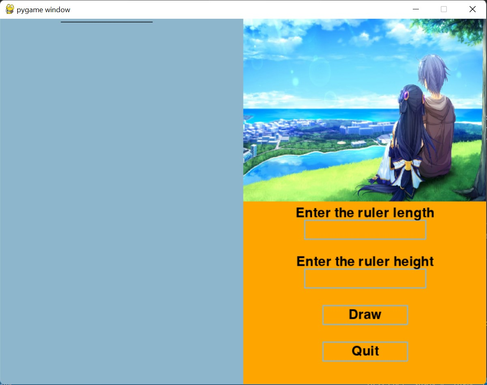

## Solve the ruler problem
In this project, we will solve the ruler problem with the divide-and-conquer algorithm
### Set up environment
```
pip install pygame
```
### How to run code?

To run the code you need to do the following steps:

#### Clone source code:
```
git clone https://github.com/UIT-20521888/Solve-the-ruler-problem.git
cd "Solve-the-ruler-problem"
```
### Run code
```
python3 thuocke.py
```
----------------------------------------------------------------
After performing the step on the main screen will appear:



You then need to enter the length of the ruler. And the height of the ruler. And finally you will make the ruler by clicking the "Draw" button. During the drawing process you can stop drawing the ruler by clicking the "Stop draw" button.

https://user-images.githubusercontent.com/90487510/204993249-c72ba25f-ea92-4b7a-834f-c31b77663741.mov

